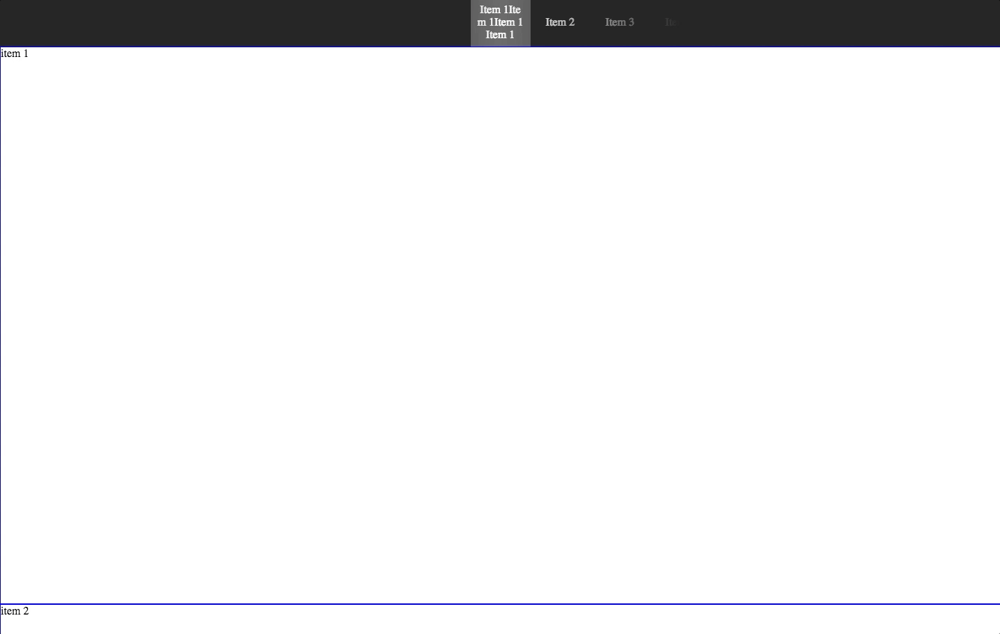

# React Scrolling Navbar

This is a React navbar component based on <a href="https://github.com/fisshy/react-scroll">react-scroll</a>. While this component is good, it doesn't support mobile well, especially when there are many items in navbar. That's why we need another navbar design for more responsiveness, mobile friendliness. 

A quick screenshot example is shown below.


A live example is [here](https://lijunray.github.io/react-scrolling-nav/static/) and [code](https://github.com/lijunray/react-scrolling-nav/blob/master/src/app/index.js) in ES6.

### Run
```
$ npm install
$ npm run start
```
Open localhost:8080, you'll see a simple example.

### Usage

ES6:
```javascript
import React, { Component } from 'react';
import NavBar, { ElementWrapper } from 'react-scrolling-nav';

class App extends Component {
    render() {
        const navBarItems = [{
            label: "Item 1Item 1Item 1Item 1",
            target: "item-1"
        }, {
            label: "Item 2",
            target: "item-2"
        }, {
            label: "Item 3",
            target: "item-3"
        }, {
            label: "Item 4",
            target: "item-4"
        }, {
            label: "Item 5",
            target: "item-5"
        }, {
            label: "Item 6",
            target: "item-6"
        }, ]
        return (
            <div>
                <Navbar items={navBarItems} offset={-80} duration={500} delay={0}>
                </Navbar>
                <div className="container">
                    <ElementsWrapper navItems={navBarItems}>
                        <div name="item-1" className="item">item 1</div>
                        <div name="item-2" className="item">item 2</div>
                        <div name="item-3" className="item">item 3</div>
                        <div name="item-4" className="item">item 4</div>
                        <div name="item-5" className="item">item 5</div>
                        <div name="item-6" className="item">item 6</div>
                    </ElementsWrapper>
                </div>
            </div>
        );
    }
}

export default App;
```
Define an array that contains all of your navbar items in format `{ label: "item1", target: "item-1" }`, where `label` is the text that you want to show on the navbar, and `target` is mapped to the `name` property in `ElementWrapper`. You should wrap all of the components to which you want to be navigated into `ElementWrapper`.

### Options
```javascript
<Navbar
    items={navbarItems} // Required, the items you want to navigate
    offset={-80} // scroll additional px
    duration={500} // time of scroll animation
    delay={0} // wait x milliseconds before scroll
    height={70} // the height of navbar
    backgroundColor={"#222"} // the background color of navbar
    coverWidth={600} // the width of the gradient cover, default is calculated by (navWidth * count of navItems)
    navWidth={86} // the width of every item on navbar
    linkClass={"link"} // the class of link
    activeLinkClass={"activeLink"} // class applied when element is reached
    />

<ElementWrapper
    items={items={navbarItems}} // Required, the items you want to navigate
    >
    // components...
    </ElementWrapper>
```
Except `coverWidth`, all values above are the default, respectively.
